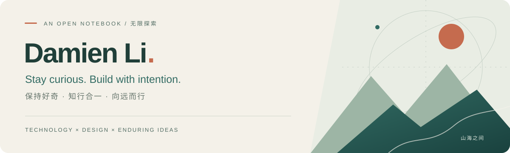

  

### A curious mind. A thoughtful builder.

Hi, I'm **Damien**. I explore the space where **AI, design and enduring ideas** meet — turning curiosity into useful tools, thoughtful experiences and a richer life.

我关心技术如何拓展人的可能，也关心人在变化中如何保持专注、独立思考与审美。让 Agent 拓展探索的边界，让自己专注判断与创造。

 

<table>
  <tr>
    <td width="33%" valign="top">
      <h3>01 / Explore · 洞察</h3>
      
AI &amp; agents, knowledge systems, better questions.

      
拓宽知识，连接线索，形成自己的判断。

    </td>
    <td width="33%" valign="top">
      <h3>02 / Make · 创造</h3>
      
Useful tools, playful interactions, considered design.

      
从想法到作品，让理性与美感相遇。

    </td>
    <td width="33%" valign="top">
      <h3>03 / Grow · 生长</h3>
      
Independent thinking, lasting value, a balanced life.

      
向内求深，向外求广，为生活保留余白。

    </td>
  </tr>
</table>

### My compass / 心之所向

**Stay open. Think clearly. Make with care. Play the long game.**

以好奇心触及前沿，以专注沉淀价值。融汇东西，尊重理性，知行合一。

  
People who inspire me / 从他们身上学习

   
  Steve Jobs · Elon Musk · Ray Dalio · Fei-Fei Li · 苏东坡 · 王阳明
  
Design, bold exploration, principles, human-centered intelligence, openness and action.

 

Always learning. Always becoming. / 持续学习，向远而行。

